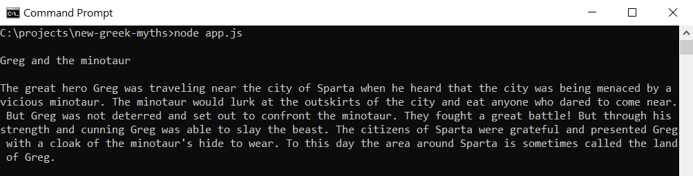

# New Greek Myths
A random text generator to create new versions of old myths. :amphora: :classical_building: Sometimes they read like the real thing... sometimes they don't.

## General info
This is a command-line program to be run with Node.js - simply run it and the myth is printed.

Example output:

Or [try it online](https://repl.it/@chrysippa/new-greek-myths)! 

## Technologies
* JavaScript (ES6)
* Node.js 14.15.3

## Status
Project is: _in progress_. (Any good story needs illustrations!)

To-do list:
* Add pictures

## Inspiration
This project fulfills the requirements of Codecademy's Mixed Messages project in the [Back-End Engineer](https://www.codecademy.com/learn/paths/back-end-engineer-career-path) path.
